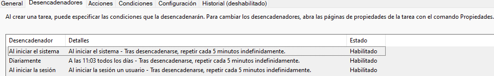

# Sincronización de Base de Datos SQLite con MySQL

## Descripción

Este proyecto se encarga de sincronizar los registros de una base de datos SQLite con una base de datos MySQL en un servidor remoto. La sincronización se realiza de manera periódica mediante un script Python que puede ser programado para ejecutarse automáticamente utilizando el Programador de Tareas de Windows.

# Pre - Requisitos

- Python 3.12.4
- Visual Basic

## Estructura del Proyecto

```
sincro_app/
├── tasks_log/
├── venv/
│   └── ...
├── .env
├── .gitignore
├── autorun.bat
├── Database.db
├── last_synced_id.txt
├── requirements.txt
├── run_in_backgrounds.vbs
└── run.py
```

## Archivos y Directorios

- `tasks_log/`: Directorio donde se almacenarán los archivos de log generados por `autorun.bat`.
- `venv/`: Entorno virtual de Python.
- `.env`: Archivo de configuración de entorno.
- `.gitignore`: Archivos y directorios a ignorar en el control de versiones.
- `autorun.bat`: Script por lotes para ejecutar el entorno virtual y el script Python.
- `run_in_background.vbs`: Script VB que oculta la acción al usuario.
- `Database.db`: Archivo de la base de datos SQLite en la raíz del directorio, se puede usar para testeos en la implementación.
- `last_synced_id.txt`: Archivo que guarda el ID del último registro sincronizado.
- `requirements.txt`: Lista de dependencias del proyecto.
- `run.py`: Script principal para ejecutar la aplicación de sincronización.

## Configuración

### Entorno Virtual

Crea y activa el entorno virtual de Python:

```
python -m venv venv
venv\Scripts\activate  # En Windows
```

### Instalación de Dependencias

Instala las dependencias necesarias utilizando pip:

```
pip install -r requirements.txt
```

### Configuración del Archivo .env

Crea un archivo .env en el directorio raíz del proyecto con las siguientes configuraciones:

```
SLEEP_TIME=10
TABLE_NUMBER=1
SERVER_URL=https://seikapp-monitor.idealtech.cl/upload
AUTH_TOKEN=*token de autorizacion
DB_PATH=*ubicacion de Database.db
TABLE_NAME=DataLogger1
DATE_COLUMN=Time
```

### Programador de Tareas en Windows

Configura una tarea programada en Windows para ejecutar el script `autorun.bat` al iniciar el sistema y cada 5 minutos, usaremos Visual Basic para ocultar la tarea del usuario:

- Acción: Iniciar un programa
- Programa o script: wscript
- Agregar argumentos (opcional): C:\ruta\al\proyecto\sincro_app\run_in_background.vbs



La tarea programada ejecutará el script Python periódicamente, sincronizando los registros entre SQLite y MySQL.

### Ejecución Manual

Para ejecutar el script manualmente, activa el entorno virtual y ejecuta el script Python:

```
venv\Scripts\activate  # En Windows
python run.py
```

Esto sincronizará los registros de la base de datos SQLite con la base de datos MySQL en el servidor remoto.

### Logs

Los registros de la ejecución del script se almacenarán en la carpeta `tasks_log` con el nombre `output_<fecha>_<hora>.log`.

Con estas instrucciones, deberías poder configurar y ejecutar la aplicación para sincronizar tus bases de datos de manera efectiva.

